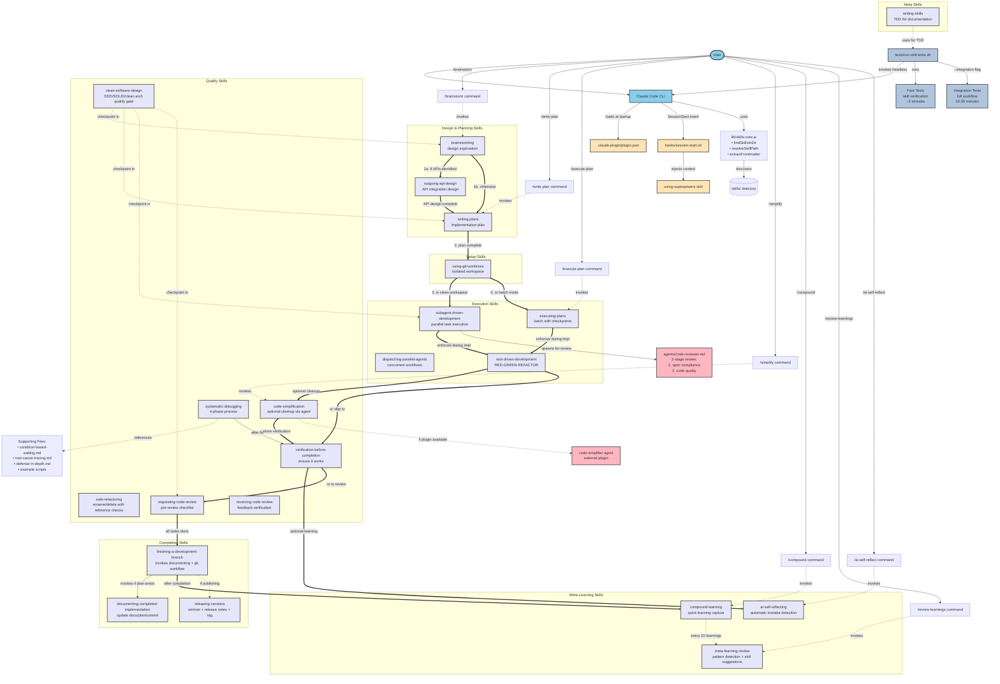
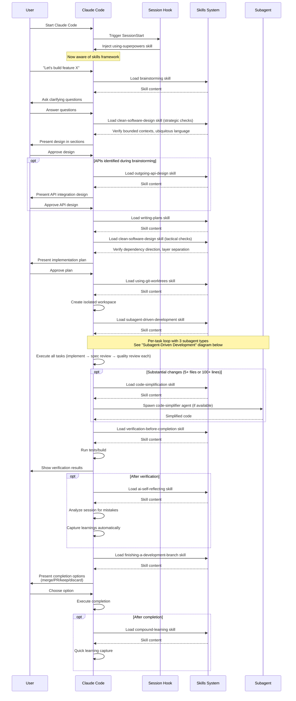
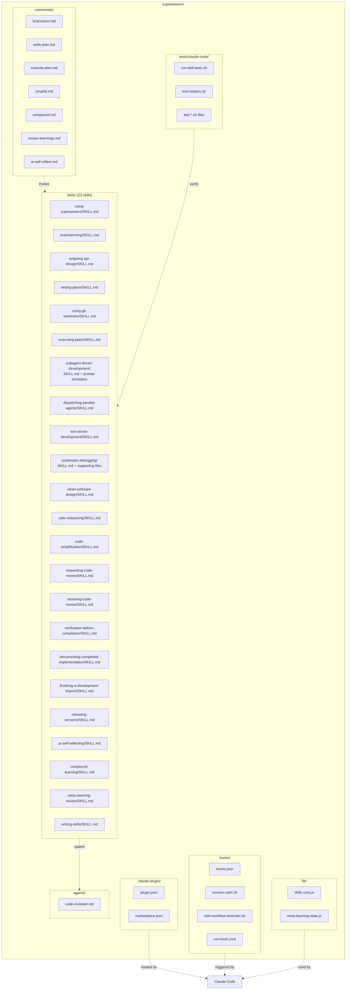
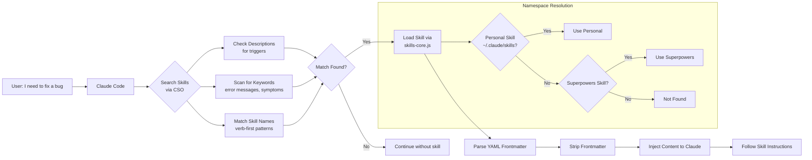
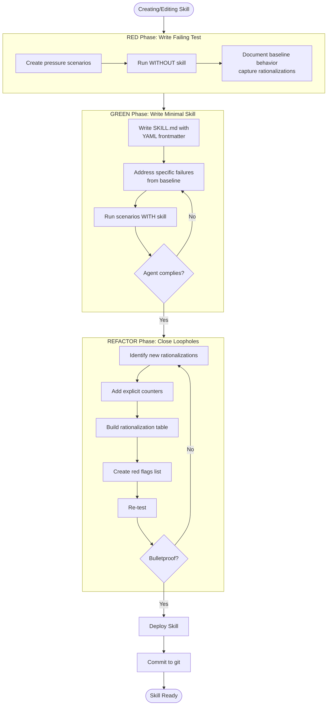
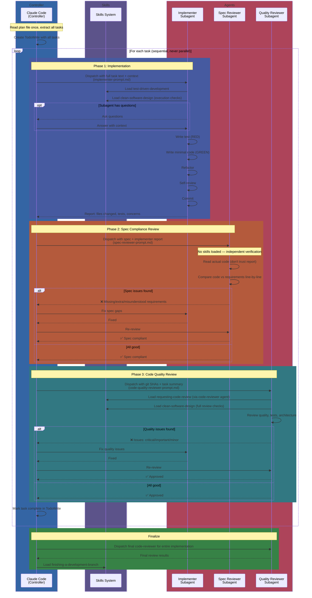

# Superpowers Architecture Visualization

## Complete System Flow

## Workflow Sequence (Typical Development Session)

## File Organization Structure

## Skill Discovery & Loading (CSO)

## Testing Workflow (TDD for Skills)

## Subagent-Driven Development (Detailed)

The subagent-driven-development skill orchestrates implementation by spawning fresh subagents per task with a two-stage review after each. The controller (main Claude session) never implements directly — it reads the plan once, extracts all tasks, and dispatches subagents sequentially.

**Color key:**
- **Blue** = Controller (main Claude session)
- **Lavender** = Skills (loaded for guidance, not actors)
- **Pink** = Agents (subagents that do the actual work)

**Key rules:**
- **Never dispatch implementation subagents in parallel** (conflicts)
- **Never start code quality review before spec compliance passes**
- **Controller provides full task text** to subagents (they never read the plan file)
- Review loops repeat until approved (no "close enough")

**Prompt templates** (in `skills/subagent-driven-development/`):

| Template                          | Subagent Type                  | Purpose                                            |
|-----------------------------------|--------------------------------|----------------------------------------------------|
| `implementer-prompt.md`           | Task (general-purpose)         | Full implementation with TDD, self-review, commit  |
| `spec-reviewer-prompt.md`         | Task (general-purpose)         | Independent verification: code matches spec        |
| `code-quality-reviewer-prompt.md` | Task (superpowers:code-reviewer) | Code quality, tests, architecture review         |

**Skills loaded by subagents:**
- **Implementer**: `test-driven-development`, `clean-software-design` (execution checks)
- **Spec reviewer**: None (independent verification from spec text only)
- **Quality reviewer**: `requesting-code-review` (via code-reviewer agent), `clean-software-design` (full review checks)

## Legend

- **Solid thick arrows (==>)**: Main workflow sequence
- **Solid arrows (-->)**: Direct usage/invocation
- **Dashed arrows (-.->)**: References/points to
- **User layer**: Light blue
- **Plugin/Hook system**: Light orange
- **Skills**: Lavender
- **Agents**: Pink
- **Testing**: Steel blue
