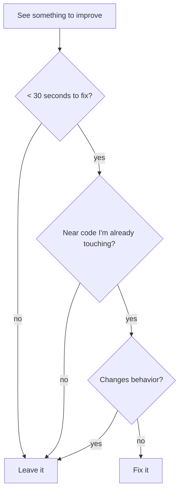

# Boy Scout Rule

**"Always leave the code cleaner than you found it."**

When you touch a file to fix a bug, add a feature, or make any change — look around. Make 2-5 small improvements to the surrounding code before moving on.

## When This Applies

**Every time you edit a file.** This is not a separate step — it's part of how you work.

## What to Improve

**In-bounds (do these):**

| Category | Examples |
|----------|----------|
| Dead code | Unused imports, unreferenced variables, commented-out code |
| Modernization | `var` to `const`/`let`, `==` to `===`, template literals |
| Clarity | Rename unclear variables, simplify needless conditionals |
| Small fixes | Fix typos in comments, remove TODO comments for things already done |
| Minor simplifications | `.filter()` instead of manual loop, early returns instead of nesting |

**Always in-bounds (regardless of proximity):**
- Unused imports / require statements at file top
- Unused module-level variables
- Stale TODO/FIXME comments for things already done

**Out-of-bounds (don't do these):**

| Category | Why not |
|----------|---------|
| Restructuring functions or classes | Too large, risk of behavior change |
| Changing public APIs or signatures | Breaks callers |
| Refactoring patterns across the file | Beyond scope — use code-simplification skill instead |
| Adding features or tests not requested | That's new work, not cleanup |
| Rewriting functions you didn't need to read | Stay near what you're already reading |

## The Rule

```
Complete your primary task FIRST.
Then make 2-5 small improvements in the same file.
Never let scouting delay or derail the main task.
```

## Scope Guard



If you catch yourself spending more than 2 minutes on improvements, **stop**. You're refactoring, not scouting.

## How to Report

After completing your primary task, briefly mention what you cleaned up:

> Fixed the off-by-one in `getPage()`. Also cleaned up: removed 3 unused imports, replaced `var` with `const` in nearby functions.

Don't ask permission for small cleanups. Just do them and report.

## Red Flags — You're Over-Scouting

- Rewriting more than 10 lines that aren't related to your task
- Changing function signatures or public interfaces
- "While I'm here, I should also refactor..."
- Spending more than 2 minutes on improvements
- Touching functions you didn't need to read for your task

**If any of these happen: stop, revert the extras, complete only your primary task with minor cleanups.**

## Common Rationalizations for NOT Scouting

| Excuse | Reality |
|--------|---------|
| "I was only asked to fix the bug" | The bug fix is your primary task. Small cleanups are professional standards. |
| "I don't want to change too much" | Removing an unused import isn't "too much." |
| "It's not my code" | You're touching it now. Leave it better. |
| "I'm in a hurry" | Removing a dead variable takes 5 seconds. |
| "It might break something" | Unused imports and `var`-to-`const` don't break things. |