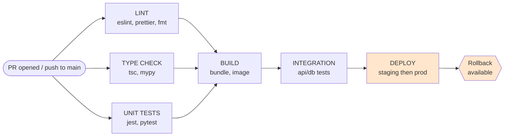

# CI/CD and Automation

## Overview

CI/CD is the enforcement mechanism for every other quality gate. Humans forget. Agents drift. The pipeline doesn't. Wire the gates once, then every change to main passes through them.

**Shift left.** A bug caught by a linter costs minutes. The same bug in production costs hours. Move checks upstream — static analysis before tests, tests before staging, staging before production.

**Smaller batches are safer.** A deploy with 3 changes is easy to debug. A deploy with 30 is a postmortem. Frequent deploys build confidence in the deploy process itself.

**Announce at start:** "I'm using the ci-cd skill to wire up the pipeline."

## The Iron Law

```
EVERY MERGE TO MAIN PASSES THE SAME GATES.
EVERY DEPLOY CAN BE ROLLED BACK.
```

No exceptions. "Just this one hotfix" is how the gates erode. If a deploy can't be rolled back, you don't have a deploy strategy — you have hope.

## When to Use

- Setting up a new project's CI pipeline
- Adding GitHub Actions / GitLab CI / CircleCI workflows
- Adding or modifying deploy automation
- Configuring branch protection rules and required status checks
- Wiring secrets into a workflow
- Reviewing/changing any `.github/workflows/*.yml` or equivalent
- Debugging CI failures that look like config problems

## Pipeline Stages

Four stages, parallelized where safe, gated where required:



**Parallelize stage 1** (lint, type, test) — they don't depend on each other. **Gate stage 4** (deploy) — never auto-deploy without passing all upstream gates.

**No gate gets skipped.** If lint fails, fix the code — don't disable the rule. If a test fails, fix the test or the code — don't add `--skip` flags.

## Caching Strategy

Cache the three things that dominate CI time: dependencies, build artifacts, and Docker layers. Cache is the cheapest performance win available — wire it from day one.

```yaml
# .github/workflows/ci.yml
jobs:
  test:
    runs-on: ubuntu-latest
    steps:
      - uses: actions/checkout@v4
      - uses: actions/setup-node@v4
        with:
          node-version: '22'
          cache: 'npm'           # caches ~/.npm by package-lock.json hash

      - name: Cache build output
        uses: actions/cache@v4
        with:
          path: |
            .next/cache
            dist
          key: build-${{ runner.os }}-${{ hashFiles('**/package-lock.json', 'src/**') }}
          restore-keys: build-${{ runner.os }}-

      - run: npm ci
      - run: npm test
```

For Docker: use `docker/build-push-action` with `cache-from: type=gha` and `cache-to: type=gha,mode=max`. For pnpm/yarn: swap `cache: 'npm'` for `'pnpm'` or `'yarn'`.

## Required Checks

Branch protection on `main` (or `master`) must require these before merge:

- **Status checks**: lint, type-check, unit tests, build — all green
- **Up-to-date branches**: PR branch must be current with base before merge
- **PR review**: at least 1 approval from a code owner
- **No force pushes** to protected branches
- **No direct pushes** — changes go through PRs only
- **Resolved conversations**: all review comments resolved before merge

If a check is "required" only sometimes, it isn't required. Pick the gate, enforce it on every PR.

## Secret Handling

**Iron Rule:** secrets never appear in YAML, in commits, in logs, in PR descriptions, in chat.

Use the platform's secret store (GitHub Secrets, GitLab CI variables, Vault, AWS Secrets Manager) and reference by name only.

```yaml
# ❌ NEVER — secret leaked to repo, history, build logs
- run: curl -X POST https://hooks.slack.com/services/T0001/B0001/SECRET-TOKEN
- env:
    DB_PASSWORD: hunter2

# ✅ ALWAYS — referenced from secret store
- run: curl -X POST "$SLACK_WEBHOOK"
  env:
    SLACK_WEBHOOK: ${{ secrets.SLACK_WEBHOOK }}
- env:
    DB_PASSWORD: ${{ secrets.DB_PASSWORD }}
```

Even for "test-only" credentials: store them as secrets. It builds the habit and prevents accidental reuse in real contexts.

If a user pastes a secret into chat or a prompt: refuse to embed it. Tell them to add it to the secret store and reference it by name.

## Branch Protection

Concrete settings to enable on `main`:

| Setting | Value |
|---|---|
| Require pull request before merging | ON |
| Required approving reviews | 1+ (2+ for shared/critical repos) |
| Dismiss stale approvals on new commits | ON |
| Require review from code owners | ON if `CODEOWNERS` exists |
| Require status checks to pass | ON, list each required job |
| Require branches to be up to date before merging | ON |
| Require conversation resolution before merging | ON |
| Require signed commits | ON if org policy demands it |
| Require linear history | Optional — prevents merge commits |
| Restrict who can push to matching branches | Maintainers only |
| Allow force pushes | OFF |
| Allow deletions | OFF |

Without these, CI is theater — the gates exist but anyone can walk around them.

## Deploy Strategy

Pick one. The choice depends on test coverage, risk tolerance, and organizational maturity.

**Continuous deploy** — every merge to main → production, automatically.
- Fits when: high test coverage, fast rollback, mature observability, small blast radius per change.
- Doesn't fit when: regulated environments, low test coverage, long manual QA cycles.

**Promotion (dev → staging → prod)** — auto-deploy to staging on merge; promote to prod via approval or schedule.
- Fits when: you need a soak window, integration tests run in staging, stakeholders verify before prod.
- The default for most teams.

**Manual approval** — PR triggers a build; deploy runs only when a human clicks "Deploy" or runs `workflow_dispatch`.
- Fits when: regulated/high-stakes deploys, off-hours releases, irreversible migrations.
- Don't make this the default — it bottlenecks on humans and makes deploys rare and scary.

In all three: every deploy is reproducible, every artifact is versioned, every release has a rollback target.

## Rollback Plan

**Non-negotiable: every deploy has a documented, tested rollback.** "We'd just redeploy the previous version" is not a rollback plan unless you've actually done it.

Pick at least one pattern:

- **Previous-version pin** — keep the last N artifacts; redeploy by tag/SHA. Works for stateless services and platforms (Vercel, Cloud Run, ECS).
- **Blue-green / traffic shift** — keep both versions running, shift traffic back instantly. Works behind load balancers.
- **Feature flag** — ship code dark, enable by flag. Roll back by toggling the flag, no redeploy needed.

What "tested" means: in the last 30 days, you (or CI) successfully rolled back a real deploy in staging or prod. Untested rollbacks fail when you need them most.

For DB migrations: every migration needs an inverse, or a forward-only path that keeps the previous app version compatible. Don't deploy code that requires a schema you can't reverse.

## Common Rationalizations

| Rationalization | Reality |
|---|---|
| "We don't need CI for this — it's a small repo" | Even a 2-step pipeline (lint + test) catches 90% of preventable breaks. Cost: 10 minutes to set up. |
| "I'll add tests to CI later" | If they're not in CI, they will rot. Wire from day one or accept they're decorative. |
| "Manual deploys are fine for now" | Manual = unrepeatable + error-prone + bus-factor 1. Automate the path you'll repeat. |
| "Caching is premature optimization" | Cache is the cheapest perf win available. Add `cache: 'npm'` from the start — it's one line. |
| "Branch protection is bureaucracy" | It's the policy. Without it, the gates are theater and anyone can merge anything. |
| "This change is trivial, skip CI" | Trivial changes break builds — that's why they feel safe. CI is fast for trivial changes anyway. |
| "The test is flaky, just re-run it" | Flaky tests mask real bugs. Quarantine or fix; never normalize re-running. |
| "We'll add a rollback plan after launch" | The first incident is a bad time to learn rollback doesn't work. Test it before launch. |
| "Just paste the webhook URL, it's just for testing" | Webhooks in YAML = webhooks in git history = webhooks on the public internet forever. |

## Red Flags

- Secrets, tokens, webhook URLs, or credentials anywhere in YAML, scripts, or commit history
- No required status checks on `main` (or required checks aren't enforced)
- No PR review requirement
- Force-push allowed on `main`
- Deploys triggered on every push with no staging gate or approval
- No documented rollback plan, or one that's never been tested
- Sequential CI jobs that could run in parallel (lint + test + type check serialized)
- "Skip CI" or `[skip ci]` used as a habit, not an exception
- Tests disabled in CI to make pipeline pass ("we'll re-enable later")
- CI green but failing locally (or vice versa) — environments diverged

## Verification

Before considering CI/CD work done:

- [ ] Pipeline runs on every PR and every push to `main`
- [ ] Lint, type-check, tests, build all run as required status checks
- [ ] Stages that can run in parallel do run in parallel
- [ ] Dependency caching is wired (npm/pnpm/yarn/pip/cargo as appropriate)
- [ ] Build artifacts and/or Docker layers cached where applicable
- [ ] All secrets referenced via `${{ secrets.NAME }}` — none inline
- [ ] Branch protection on `main` enforces required checks + reviews + no force-push
- [ ] Deploy strategy chosen and documented (continuous / promotion / manual approval)
- [ ] Rollback plan documented AND exercised at least once
- [ ] Pipeline completes in < 10 minutes on a clean cache miss (target; tune if larger)
- [ ] CI failures produce actionable logs, not just "command failed"

If a box can't be checked, that's the next task — not a "later" task.

## Integration

**Pairs with:**
- `superpowers:test-driven-development` — CI is where the failing-test-first discipline gets enforced for everyone
- `superpowers:releasing-versions` — deploy automation triggers from release tags
- `superpowers:finishing-a-development-branch` — CI must be green before merge options are presented
- `superpowers:requesting-code-review` — required reviewers are part of branch protection

> Translated and adapted from [addyosmani/agent-skills](https://github.com/addyosmani/agent-skills) (MIT License).
