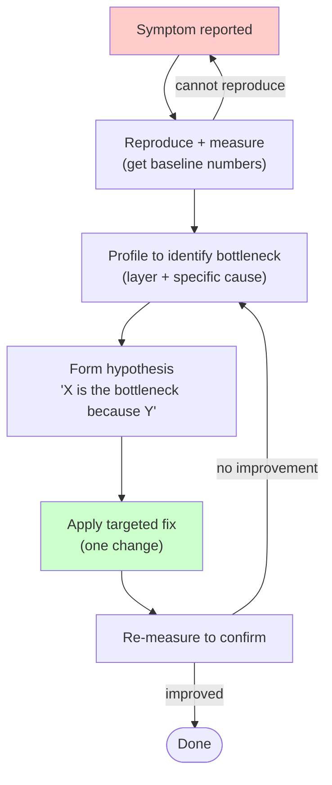
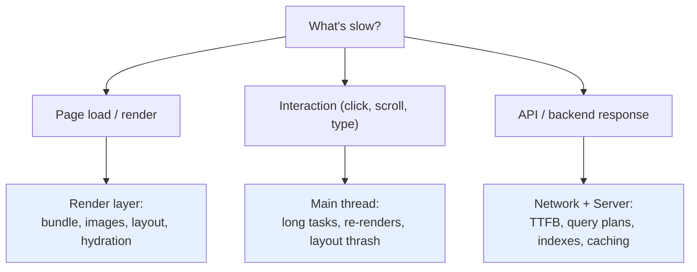

# Performance

## Overview

Performance work without measurement is guessing. Most "obvious" bottlenecks are wrong. Profile first, identify the actual bottleneck, fix it, measure again. Optimize only what measurements prove matters.

**Core principle:** Premature optimization adds complexity that costs more than the performance it gains. Premature *measurement*, however, costs almost nothing and prevents the entire problem.

## The Iron Law

```
MEASURE FIRST, OPTIMIZE SECOND.
NO OPTIMIZATION WITHOUT A PROFILE.
```

If you haven't reproduced the slowness and captured numbers, you cannot propose fixes.

**No exceptions:**
- Don't sprinkle `useMemo` because "it's probably re-rendering too much"
- Don't add caching "to be safe"
- Don't code-split because "the bundle is probably big"
- Don't refactor a query because "it looks slow"

If you change code without before/after numbers, you don't know if you helped, hurt, or no-op'd.

## When to Use

- Users or monitoring report slow behavior
- Core Web Vitals scores below thresholds (LCP > 2.5s, INP > 200ms, CLS > 0.1)
- Response-time SLA breached
- A change is suspected of introducing a regression
- Building features that handle large datasets or high traffic
- Performance budget set in spec or CI

**When NOT to use:** Don't optimize speculatively. No evidence of a problem = no optimization. Add monitoring instead so future-you has data.

## The Investigation Workflow



**Cannot reproduce?** Gather more data (which page, device, network, time of day). Don't guess.

**Re-measure shows no improvement?** Your hypothesis was wrong. Revert the change. Profile again.

## Core Web Vitals

Targets every web page should meet:

| Metric | Good | Needs Work | Poor | What it captures |
|--------|------|------------|------|------------------|
| **LCP** (Largest Contentful Paint) | ≤ 2.5s | ≤ 4.0s | > 4.0s | When the main content becomes visible |
| **INP** (Interaction to Next Paint) | ≤ 200ms | ≤ 500ms | > 500ms | Responsiveness to clicks, taps, key presses |
| **CLS** (Cumulative Layout Shift) | ≤ 0.1 | ≤ 0.25 | > 0.25 | Visual stability (things jumping around) |
| **FCP** (First Contentful Paint) | ≤ 1.8s | ≤ 3.0s | > 3.0s | When *anything* paints (loading feedback) |

Use **field data** (CrUX, RUM via `web-vitals` library) to know what real users experience. Lab data (Lighthouse) is for regression detection, not user truth.

## Three Layers — Where to Investigate

Match the symptom to the layer. Don't guess across layers.

| Symptom | Likely layer | Start here |
|---------|--------------|------------|
| Slow first paint, slow LCP, large bundle warnings | **Render / client** | DevTools Performance trace, bundle analyzer, network waterfall |
| Slow TTFB, slow API responses, list endpoints timeout | **Network / server** | Network waterfall, server response logs, APM |
| Single endpoint slow, slowness scales with data | **Database** | Query log, EXPLAIN plan, index check |
| UI freezes on click, jank on scroll, poor INP | **Render / main thread** | Performance trace, look for long tasks (>50ms) |
| All endpoints slow at once | **Network / infra** | Connection pool, CPU, memory, GC pauses |



## Render Performance

Symptoms: slow LCP, jank on scroll, INP > 200ms, layout shift, hydration warnings.

Common levers (apply only after profiling shows the bottleneck):

- **Virtualization** for long lists (>~200 items rendered at once). Libraries: `react-window`, `@tanstack/react-virtual`. Note: 50 items should not need virtualization — investigate other causes.
- **Memoization** (`React.memo`, `useMemo`, `useCallback`) for expensive components or computations. Costs: extra dependency-array bookkeeping, harder mental model. Apply where a profiler shows wasted re-renders, not preemptively.
- **Code splitting** at routes and heavy features (`lazy()` + `<Suspense>`). Measure bundle size before and after.
- **Hydration costs**: large server-rendered trees with heavy client components. Consider islands / partial hydration.
- **Layout thrash**: avoid interleaved DOM reads and writes. Batch reads, then batch writes.
- **Long tasks**: break up work over 50ms with `scheduler.yield()` (preferred), `scheduler.postTask()`, or a `yieldToMain` pattern. Move heavy compute to Web Workers.

Image specifics: explicit `width`/`height` (prevents CLS), `loading="lazy"` below the fold, `fetchpriority="high"` on the LCP image, modern formats (AVIF/WebP), responsive `srcset`/`sizes`.

## Network Performance

Symptoms: slow TTFB, request waterfalls, slow asset delivery, repeat requests for the same data.

Common levers:

- **Caching headers**: `Cache-Control: public, max-age=...` for static assets (with content hashing), `Cache-Control: no-cache` for HTML if you need revalidation. Avoid `no-store` on HTML — kills bfcache.
- **CDN** for static assets and edge-cacheable API responses.
- **Request batching / deduplication** at the client for chatty APIs.
- **Compression**: gzip or brotli on text responses.
- **HTTP/2 or HTTP/3** to remove head-of-line blocking on multiplexed requests.
- **Preconnect / dns-prefetch** for known third-party origins on the LCP path.
- **Image optimization**: serve WebP/AVIF, responsive sizes, correct dimensions.

If TTFB is slow, isolate which component is slow in the DevTools Network waterfall: DNS, TCP/TLS, server "Waiting (TTFB)". Different culprits, different fixes.

## Database Performance

Symptoms: a single endpoint slow, slowness grows with data size, p95 latency climbs as traffic grows.

The most common culprits, in order:

1. **N+1 queries** — one query per row of a parent collection.

   ```typescript
   // BAD: 1 + N queries
   const tasks = await db.tasks.findMany();
   for (const task of tasks) {
     task.owner = await db.users.findUnique({ where: { id: task.ownerId } });
   }

   // GOOD: 1 query with a join / include
   const tasks = await db.tasks.findMany({
     include: { owner: true },
   });
   ```

2. **Missing indexes** on filtered or sorted columns. Run `EXPLAIN` (Postgres) / equivalent. Look for sequential scans on large tables.
3. **Unbounded queries** — `SELECT *` without `LIMIT`. Always paginate list endpoints.
4. **Connection pool exhaustion** under load. Check pool size vs concurrency.
5. **Lock contention** — long transactions blocking readers. Inspect locks during slow periods.

Always check the query plan. The optimizer's choice often surprises you.

## Cost-Benefit Decision Table

When is a given optimization worth its complexity?

| Optimization | Complexity cost | Worth it when |
|---|---|---|
| Adding an index | Low (write a migration) | Query plan shows seq scan on a filtered column with growing rows |
| Pagination | Low | Any list endpoint that can grow unbounded |
| Caching (in-memory) | Medium (invalidation, staleness) | Read-heavy, rarely-changes, measurable repeat-fetch cost |
| Caching (Redis / shared) | High (operational dep, invalidation) | Multiple instances, hot read, latency budget tight |
| `useMemo` / `React.memo` | Low–medium (mental overhead, deps drift) | Profiler shows wasted renders OR computation > 1ms per render |
| Code splitting | Medium (loading states, error boundaries) | Bundle > 200KB gzipped OR clearly route-bound feature |
| Virtualization | Medium (scroll bugs, accessibility) | List > ~200 items rendered simultaneously |
| Web Worker | High (serialization, debugging) | CPU-bound work > 50ms blocking the main thread |
| Edge / CDN deployment | High (cache invalidation, ops) | Geographic latency dominates AND content is cacheable |
| Server-side rendering | High (infra, hydration cost) | LCP gated on data; client-only fetch waterfall is the bottleneck |

If the row's "Worth it when" condition isn't proven by your measurements, the optimization is premature.

## Common Rationalizations

| Excuse | Reality |
|---|---|
| "This is obviously slow" | Profile or you're guessing. Most "obvious" bottlenecks are wrong. |
| "Memoize everything" | Memoization has a cost (deps bookkeeping, indirection). Measure first. |
| "I'll add caching to be safe" | Caching is a complexity tax: invalidation, staleness, operational load. Add it where measured. |
| "Premature optimization is evil so I won't measure either" | Premature ≠ no measurement. Measure always; optimize when measurements warrant. |
| "Users said it's slow" | Where? When? On what device? Get a reproducible repro before fixing. |
| "It's fast on my machine" | Your laptop isn't your user's mid-range Android on 4G. Profile on representative hardware. |
| "We'll optimize later" | "Later" never comes; perf debt compounds. Fix obvious anti-patterns (N+1, unbounded queries) now. |
| "The framework handles performance" | Frameworks prevent some issues but can't fix N+1 queries, missing indexes, or oversized bundles. |
| "50 items is a lot, let me virtualize" | 50 items shouldn't be slow. If they are, the cause is elsewhere — N+1, layout thrash, expensive per-item render. |
| "Users won't notice 100ms" | Research shows 100ms delays move conversion. Users notice more than you think. |

## Red Flags — STOP

If you catch yourself doing any of these without numbers in front of you:

- Sprinkling `useMemo` / `useCallback` / `React.memo` without a profiler trace
- Adding caching without measuring repeat-fetch cost or hit rate
- Code-splitting before checking actual bundle size
- "Optimizing" a query without an `EXPLAIN` plan
- Refactoring a hot path because it "looks slow"
- Micro-optimizing inside a function that isn't the bottleneck
- Citing a benchmark from a blog post instead of measuring your own code
- Proposing a fix before reproducing the symptom

**All of these mean: STOP. Reproduce + profile first.**

## Verification

Before claiming a performance fix is done:

- [ ] Symptom reproduced before the fix (specific numbers captured)
- [ ] Bottleneck identified by profiler / query plan / waterfall (not assumed)
- [ ] Hypothesis written down: "X is the cause because Y"
- [ ] Single targeted change applied (no bundled refactors)
- [ ] Re-measured after the fix (specific numbers, same conditions)
- [ ] Improvement is real and meaningful (not within noise)
- [ ] Core Web Vitals in "Good" thresholds (if user-facing)
- [ ] Bundle size hasn't regressed (if frontend change)
- [ ] No new N+1 queries introduced (if data-fetching change)
- [ ] Behavior tests still pass (optimization didn't change semantics)
- [ ] Monitoring or budget added so a regression is caught next time

Cannot check before/after numbers? Then the work isn't done — it's a guess.

## See Also

For the heavy quick-reference checklist (frontend / backend / measurement commands / anti-patterns), see `performance/performance-checklist.md`.

Related skills:
- `superpowers:systematic-debugging` — when investigating *why* something is slow, the four-phase process applies
- `superpowers:test-driven-development` — when adding regression tests for a perf bug
- `superpowers:verification-before-completion` — confirms the fix actually works under realistic conditions

> Translated and adapted from [addyosmani/agent-skills](https://github.com/addyosmani/agent-skills) (MIT License).
