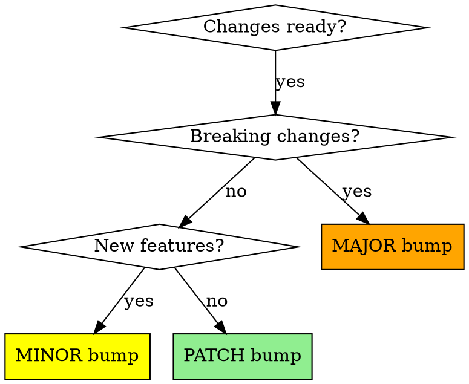

# Releasing Versions

## Overview

Systematic version bumping with semantic versioning, comprehensive release notes, and complete release workflow.

**Core principle:** Verify before bump → Choose version correctly → Document thoroughly → Tag and publish.

**Announce at start:** "I'm using the releasing-versions skill to prepare the release."

## When to Use

- After completing features/fixes that need publishing
- When user asks to "bump version" or "prepare release"
- Before creating release tags or publishing packages

## Semantic Versioning Decision

Given version `MAJOR.MINOR.PATCH`:



**MAJOR (X.0.0)** - Breaking changes:
- Renamed commands, skills, or APIs
- Removed features users depend on
- Changed behavior that breaks existing usage
- Incompatible with previous version

**MINOR (x.Y.0)** - New features (backward-compatible):
- New skills added
- New commands added
- New features that don't break existing usage

**PATCH (x.y.Z)** - Bug fixes and minor improvements:
- Bug fixes
- Documentation updates
- Refactoring without behavior changes
- Performance improvements

## Release Workflow

### Step 1: Pre-Flight Verification

**Check git status:**
```bash
git status
```

**Verify:**
- [ ] Working tree is clean OR only expected modifications present
- [ ] All relevant changes are committed
- [ ] No accidental files included
- [ ] Currently on the branch you want to release from (usually `main`)

**If unclean:** Ask user to review uncommitted changes first.

### Step 2: Review Changes

**Check what changed since last release:**
```bash
# Get last release tag
LAST_TAG=$(git describe --tags --abbrev=0 2>/dev/null || echo "")

# If tag exists, show changes since then
if [ -n "$LAST_TAG" ]; then
    git log $LAST_TAG..HEAD --oneline
    git diff $LAST_TAG..HEAD --stat
else
    # No tags yet, show recent commits
    git log --oneline -n 20
fi
```

**Identify:**
- What changed? (features, fixes, docs, refactoring)
- Any breaking changes?
- Which files were modified?

### Step 3: Determine Version Bump

**Based on changes, determine bump type:**

Ask user if unclear:
```
Based on these changes, I see [summary].

This looks like a [MAJOR/MINOR/PATCH] version bump because [reason].

Current version: X.Y.Z
Proposed version: [new version]

Is this correct?
```

**Examples:**
- Renamed skill → MAJOR (breaking change)
- New skill added → MINOR (new feature)
- Fixed bug in existing skill → PATCH (bug fix)
- Updated documentation → PATCH (non-functional)

### Step 4: Update Version Files

**For this repository:**
```bash
# Update .claude-plugin/plugin.json
jq '.version = "X.Y.Z"' .claude-plugin/plugin.json > tmp.json && mv tmp.json .claude-plugin/plugin.json
```

**For other projects, check:**
- `package.json` (Node.js)
- `pyproject.toml` or `setup.py` (Python)
- `Cargo.toml` (Rust)
- `pom.xml` (Maven)
- Other project-specific version files

**If CLAUDE.md references version:** Update it too.

### Step 5: Update Release Notes

**Structure for RELEASE-NOTES.md:**

```markdown
## vX.Y.Z (YYYY-MM-DD)

### [Breaking Changes] (only if MAJOR bump)

**[Change Title]**

- What changed: [old behavior → new behavior]
- Why: [rationale]
- Migration: [how users should update]

### [Improvements|Bug Fixes|Documentation]

**[Change Title]**

[Description of what changed and why]

**[Category] updated:**
- File/component 1 - Description
- File/component 2 - Description

**[Details section if needed]:**
- Additional context
- Related changes
- Source references
```

**Required sections:**
- Date in YYYY-MM-DD format
- Clear change titles
- What changed and why
- List of affected files/components

**Breaking changes section (MAJOR bumps only):**
- What broke
- Why it changed
- How to migrate
- Communication plan

### Step 6: Commit Changes

**Commit version bump and release notes:**
```bash
git add .claude-plugin/plugin.json RELEASE-NOTES.md [other version files]
git commit -m "chore: bump version to X.Y.Z"
```

**Message format:**
- `chore: bump version to X.Y.Z` for version bumps
- Keep it simple and consistent

### Step 7: Tag Release

**Create annotated tag:**
```bash
git tag -a vX.Y.Z -m "Release version X.Y.Z"
```

**Tag naming:**
- Use `vX.Y.Z` format (lowercase v prefix)
- Annotated tags (not lightweight)
- Message: "Release version X.Y.Z"

### Step 8: Push Changes

**Push commits and tags:**
```bash
git push origin main  # or current branch
git push origin vX.Y.Z  # push tag
```

**Verify:**
- Commits appear on remote
- Tag appears in repository tags

### Step 9: Post-Release Actions

**For this repository (superpowers):**
- Plugin marketplace automatically syncs from git tags
- No manual marketplace update needed

**For other projects:**
- [ ] Publish to package registry (npm, PyPI, crates.io, etc.)
- [ ] Update marketplace/distribution channel
- [ ] Create GitHub release from tag
- [ ] Announce release (if breaking changes)

## Quick Reference

| Change Type | Version Bump | Example |
|-------------|-------------|---------|
| Renamed API/skill | MAJOR | 4.1.9 → 5.0.0 |
| Removed feature | MAJOR | 2.3.1 → 3.0.0 |
| New skill added | MINOR | 4.1.9 → 4.2.0 |
| New feature | MINOR | 1.5.2 → 1.6.0 |
| Bug fix | PATCH | 4.1.9 → 4.1.10 |
| Docs update | PATCH | 3.2.1 → 3.2.2 |
| Refactoring | PATCH | 2.4.5 → 2.4.6 |

## Common Mistakes

| Mistake | Fix |
|---------|-----|
| Bump version without checking git status | Always run `git status` first |
| Patch bump for new features | New features = MINOR bump |
| Minor bump for breaking changes | Breaking changes = MAJOR bump |
| Forget to tag after commit | Tag is required: `git tag -a vX.Y.Z -m "..."` |
| Push commits but not tag | Always push both: `git push && git push origin vX.Y.Z` |
| Incomplete release notes | List all affected files and explain why |
| No migration guide for breaking changes | Breaking changes need migration instructions |
| Version files out of sync | Check all version files (package.json, CLAUDE.md, etc.) |

## Red Flags - STOP and Review

- Version bumped without git status check
- "This is just a small change" (still needs proper versioning)
- Skipping release notes
- Not tagging the release
- Breaking change without MAJOR bump
- New feature without MINOR bump

## Example: Complete Release Process

**Scenario:** Added new `code-review` skill

```bash
# 1. Check status
git status  # Clean? All committed?

# 2. Review changes
git log v4.1.9..HEAD --oneline
# Shows: "feat: add code-review skill"

# 3. Decision: New skill = MINOR bump (4.1.9 → 4.2.0)

# 4. Update version
jq '.version = "4.2.0"' .claude-plugin/plugin.json > tmp.json && mv tmp.json .claude-plugin/plugin.json

# 5. Write release notes
# Add v4.2.0 section to RELEASE-NOTES.md

# 6. Commit
git add .claude-plugin/plugin.json RELEASE-NOTES.md
git commit -m "chore: bump version to 4.2.0"

# 7. Tag
git tag -a v4.2.0 -m "Release version 4.2.0"

# 8. Push
git push origin main
git push origin v4.2.0

# 9. Verify tag appears on remote
```

## Project-Specific Notes

**For superpowers repository:**
- Version in: `.claude-plugin/plugin.json`
- Release notes: `RELEASE-NOTES.md`
- Marketplace updates automatically from tags
- No manual publishing needed

**For other projects:**
- Check project documentation for version file locations
- Check for automated publishing workflows
- Verify publishing steps with project maintainers
