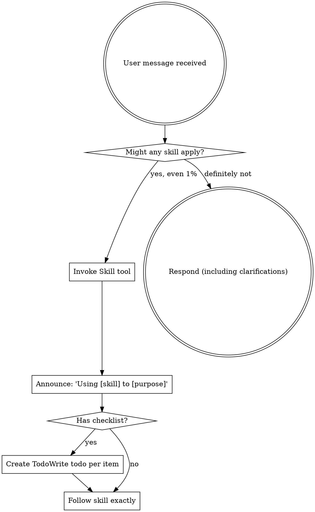

<EXTREMELY-IMPORTANT>
If you think there is even a 1% chance a skill might apply to what you are doing, you ABSOLUTELY MUST invoke the skill.

IF A SKILL APPLIES TO YOUR TASK, YOU DO NOT HAVE A CHOICE. YOU MUST USE IT.

This is not negotiable. This is not optional. You cannot rationalize your way out of this.
</EXTREMELY-IMPORTANT>

## How to Access Skills

**In Claude Code:** Use the `Skill` tool. When you invoke a skill, its content is loaded and presented to you—follow it directly. Never use the Read tool on skill files.

**In other environments:** Check your platform's documentation for how skills are loaded.

# Using Skills

## The Rule

**Invoke relevant or requested skills BEFORE any response or action.** Even a 1% chance a skill might apply means that you should invoke the skill to check. If an invoked skill turns out to be wrong for the situation, you don't need to use it.



## Red Flags

These thoughts mean STOP—you're rationalizing:

| Thought | Reality |
|---------|---------|
| "This is just a simple question" | Questions are tasks. Check for skills. |
| "I need more context first" | Skill check comes BEFORE clarifying questions. |
| "Let me explore the codebase first" | Skills tell you HOW to explore. Check first. |
| "I can check git/files quickly" | Files lack conversation context. Check for skills. |
| "Let me gather information first" | Skills tell you HOW to gather information. |
| "This doesn't need a formal skill" | If a skill exists, use it. |
| "I remember this skill" | Skills evolve. Read current version. |
| "This doesn't count as a task" | Action = task. Check for skills. |
| "The skill is overkill" | Simple things become complex. Use it. |
| "I'll just do this one thing first" | Check BEFORE doing anything. |
| "This feels productive" | Undisciplined action wastes time. Skills prevent this. |
| "I know what that means" | Knowing the concept ≠ using the skill. Invoke it. |

## Skill Priority

When multiple skills could apply, use this order:

1. **Process skills first** (brainstorming, debugging) - these determine HOW to approach the task
2. **Implementation skills second** (frontend-design, mcp-builder) - these guide execution

"Let's build X" → brainstorming first, then implementation skills.
"Fix this bug" → debugging first, then domain-specific skills.

## Skill Types

**Rigid** (TDD, debugging): Follow exactly. Don't adapt away discipline.

**Flexible** (patterns): Adapt principles to context.

The skill itself tells you which.

## Executing Skills

When you invoke a skill via the Skill tool:

1. **The skill content is loaded and presented to you** - it's not in your training data
2. **Read it completely before starting** - don't work from memory or assumptions
3. **Follow documented steps exactly** - don't improvise or skip steps
4. **Check "Success Criteria" section** to verify completion
5. **For rigid skills, every step is mandatory** - no shortcuts

**Common mistake:** Invoking a skill but then working from assumed understanding instead of following the loaded content step-by-step.

## Model Selection for Skills

**IMPORTANT**: Use appropriate models to balance quality and cost.
- **Opus** for brainstorming/design (use Task tool with `model="opus"`)
- **Sonnet** for planning, code review, debugging
- **Haiku** for execution, TDD, verification

See model-selection.md for full breakdown by skill.

## User Instructions

Instructions say WHAT, not HOW. "Add X" or "Fix Y" doesn't mean skip workflows.

## Common Trigger Phrases

Recognize these user phrases as skill invocation triggers:

| User Says | Skill to Invoke | Why |
|-----------|----------------|-----|
| "let's complete this", "finish this work", "wrap this up", "we're done", "finalize this" | `finishing-a-development-branch` | Completion signals require proper workflow (documentation, tests, git integration) |
| "this is broken", "tests are failing", "not working" | `systematic-debugging` | Issues require root cause investigation before fixes |
| "add feature X", "implement Y" | `brainstorming` first | Design decisions before implementation |
| "plan this out", "how should we approach this" | `writing-plans` | Multi-step tasks need structured planning |
| "is this ready to merge", "can we ship this" | `verification-before-completion` | Claims require evidence |
| "clean this up", "simplify the code", "make this cleaner" | `code-simplification` | Code quality improvement via code-simplifier agent |

**Exception:** Only skip skill if user explicitly says "skip the workflow" or "just commit it".

## Workflow Discipline: Mandatory, Not Optional

### Never Skip Skill Steps

When using a skill, **follow EVERY step exactly as written**:

- ❌ **Bad:** "This step seems optional, I'll skip it"
- ❌ **Bad:** "I understand the intent, I'll do it my way"
- ❌ **Bad:** "Step 1 says invoke another skill, but I'll just do the work directly"
- ✅ **Good:** Read every step, execute every step, in order, exactly as documented

**Example: finishing-a-development-branch**
- Step 0: Pre-flight check
- **Step 1: Invoke `documenting-completed-implementation` if plan exists** ← NEVER SKIP THIS
- Step 2: Verify tests/build
- Step 3: Determine base branch
- Step 4: Present options
- Step 5: Execute choice

**If you think "I'll skip this step because..." → STOP. Follow the skill.**

### Always Suggest Next Skills Proactively

After completing ANY skill:

1. **State completion clearly:**
   - "✅ [skill] complete - [brief outcome]"
   - Example: "✅ verification-before-completion finished - all tests pass"

2. **Consult the Common Workflow Chains table below**
   - This table is the **source of truth**
   - Don't work from memory
   - Check it EVERY time

3. **Suggest next skill immediately:**
   - Be directive: "**Next step:** Use `superpowers:[next-skill]` to [purpose]"
   - Not passive: ❌ "What would you like to do next?"
   - Not optional: ❌ "You could maybe try..."

**Users should NEVER have to ask "what's next?"**

### Common Mistakes to Avoid

| Mistake | Example | Correct Behavior |
|---------|---------|------------------|
| **Not suggesting next skill** | Completes verification, waits for user to ask | Immediately suggest finishing-a-development-branch |
| **Skipping skill steps** | Uses finishing skill but skips Step 1 (documenting) | Follow every step in order |
| **Suggesting wrong skill** | After verification, suggests compound-learning instead of finishing | Consult workflow chains table |
| **Being passive** | "What would you like to do?" after completing work | "**Next step:** Use [skill]..." |
| **Working from memory** | "I remember this skill does X" | Read the actual loaded skill content |

## Common Workflow Chains

**This table is mandatory** - consult it after EVERY skill completion:

| After This Skill                 | Suggest This Next                                                                    | When                                                                       |
|----------------------------------|--------------------------------------------------------------------------------------|----------------------------------------------------------------------------|
| `brainstorming`                  | `writing-plans`                                                                      | Design is validated and ready for implementation                           |
| `writing-plans`                  | `using-git-worktrees` - > Choice: `executing-plans` OR `subagent-driven-development` | Plan is complete, ask which execution approach                             |
| `executing-plans`                | `code-simplification` (optional) → `verification-before-completion`                  | All tasks complete; offer simplification if 5+ files or 100+ lines changed |
| `subagent-driven-development`    | `code-simplification` (optional) → `verification-before-completion`                  | All tasks complete; offer simplification if 5+ files or 100+ lines changed |
| `code-simplification`            | `requesting-code-review` OR `verification-before-completion`                         | Code refined; choose review or verify                                      |
| `test-driven-development`        | `verification-before-completion`                                                     | Tests passing and implementation complete                                  |
| `systematic-debugging`           | `verification-before-completion`                                                     | Fix implemented                                                            |
| `verification-before-completion` | `finishing-a-development-branch`                                                     | All tests pass                                                             |
| `requesting-code-review`         | `finishing-a-development-branch`                                                     | Feedback addressed                                                         |
| `finishing-a-development-branch` | `ai-self-reflecting` OR `compound-learning`                                          | Work integrated, capture learnings                                         |

**Format for suggestions:**
```
✅ [skill] complete - [brief outcome]

**Next step:** Use `superpowers:[next-skill]` to [purpose]
```

**This is not guidance. This is mandatory workflow discipline.**
