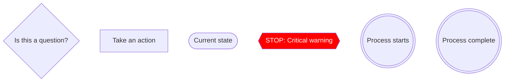
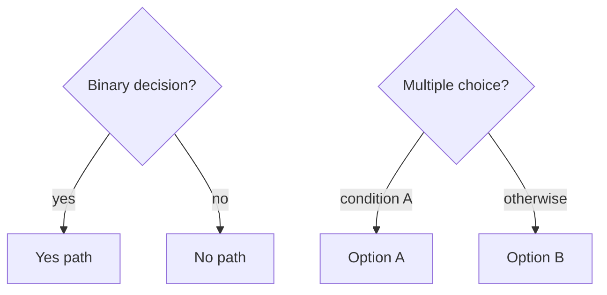
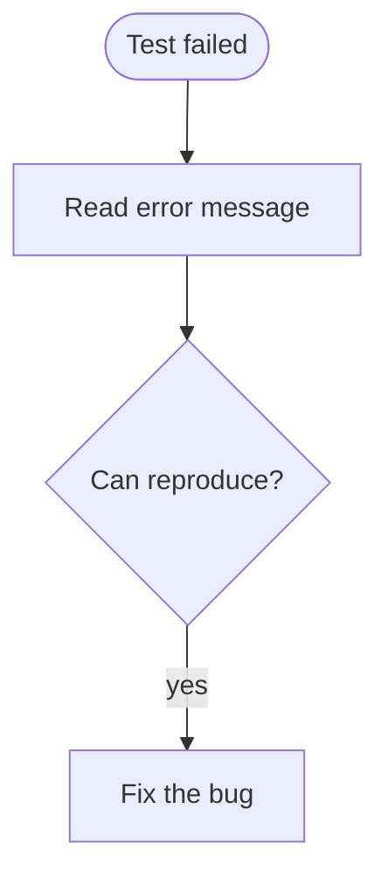
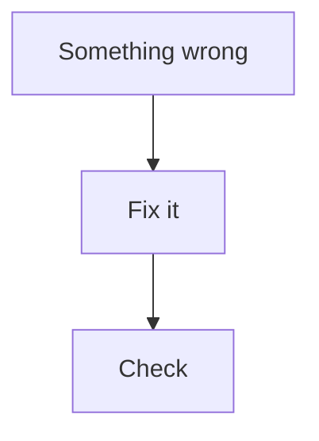

# Mermaid Conventions

Style guide for diagrams in skills. Covers flowcharts and sequence diagrams.

## Color Palette

Use dark backgrounds with light text for readability across themes.

**Participant/box colors (sequence diagrams):**

| Role | RGB | Use For |
|------|-----|---------|
| Controller | `rgb(52,101,164)` | Main Claude session, orchestrator |
| Skills | `rgb(92,83,138)` | Skills System, skill loading |
| Agents | `rgb(173,68,90)` | Subagents that do work |

**Phase/rect colors (sequence diagram regions):**

| Phase | RGB | Use For |
|-------|-----|---------|
| Implementation | `rgb(70,90,160)` | Coding, TDD, commits |
| Spec review | `rgb(180,90,60)` | Spec compliance verification |
| Quality review | `rgb(50,120,130)` | Code quality, architecture checks |
| Finalize/success | `rgb(55,130,70)` | Completion, green-light steps |

**Flowchart classDefs:**

| Style | Definition | Use For |
|-------|-----------|---------|
| warning | `fill:red,color:white` | Prohibitions, stop signals |
| success | `fill:lightgreen` | Completed, approved |
| highlight | `fill:lightblue` | Emphasis |

## Flowcharts

### Node Types and Shapes



### Shape Selection

| Shape | Mermaid Syntax | Use For |
|-------|---------------|---------|
| Diamond `{text}` | `A{Is test passing?}` | Decisions, yes/no questions |
| Rectangle `[text]` | `A[Write test first]` | Actions, steps |
| Stadium `([text])` | `A([Current state])` | States, situations |
| Hexagon `{{text}}` | `A{{NEVER do this}}` | Warnings, prohibitions |
| Double circle `(((text)))` | `A(((Done)))` | Entry/exit points |

### Edge Labels



### Naming Patterns

- **Questions** end with `?`: "Should I do X?", "Is Z true?"
- **Actions** start with verb: "Write the test", "Commit changes"
- **States** describe situation: "Test is failing", "Build complete"

## Sequence Diagrams

### Participant Boxes

Group participants by role using colored boxes:

```
box rgb(52,101,164) Controller
participant CC as Claude Code
end
box rgb(92,83,138) Skills
participant S as Skills System
end
box rgb(173,68,90) Agents
participant I as Implementer Subagent
end
```

### Phase Regions

Use `rect` to visually group phases:

```
rect rgb(70,90,160)
    Note over CC,I: Phase 1: Implementation
    CC->>I: Dispatch task
    I-->>CC: Report
end
```

### Arrow Types

| Arrow | Syntax | Use For |
|-------|--------|---------|
| Solid | `->>` | Direct action, dispatch |
| Dashed return | `-->>` | Response, report back |
| Self-call | `->>` same participant | Internal action |

## Good vs Bad

**Good:** Specific labels, correct shapes


**Bad:** Vague labels, wrong shapes

